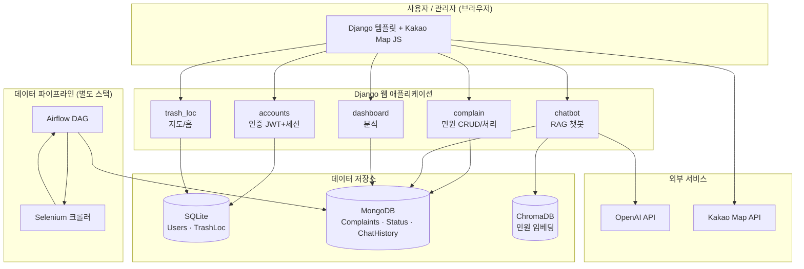

# 🗑️ zer0 Litter (0L)

[](https://github.com/zer0-Litter/zer0-Litter/actions/workflows/ci.yml)

**쓰레기통 위치 확인 및 민원 신고 챗봇 서비스**

쓰레기 무단 투기 문제를 해결하고 지자체의 행정 효율을 높이기 위해, AI 챗봇을 활용하여 시민들이 **가까운 쓰레기통 위치를 쉽게 찾고 민원을 간편하게 신고**할 수 있도록 돕는 B2C/B2G 통합 플랫폼입니다.

---

## 🌟 주요 기능 (Features)

| 기능 분류 | 핵심 내용 |
| :--- | :--- |
| **지도 및 길찾기** | 현 위치 기반 $100m/200m/300m$ 이내 쓰레기통 위치 추천 및 Kakao Map 연동 길찾기 기능 제공. |
| **민원 신고 간소화** | Kakao Map API를 통한 위치 자동 입력, 다중 신고 유형 선택, 사진 첨부, **이전 민원 불러오기(재민원)** 기능으로 UX 개선. |
| **AI 챗봇 (zL 오웰)** | `GPT-4o-mini` RAG 기반 챗봇으로 대화형 민원 접수 및 쓰레기통 위치 찾기 지원. **불필요한 응답을 차단**하여 정확성 확보. |
| **관리자/사용자 대시보드** | 관리자 민원 처리/완료 상태 변경 기능 및 사용자/관리자용 통계 대시보드 제공. |
| **민원 통계 분석** | **요일별 민원 건수, 자치구별 민원 응답 속도 편차** 등을 시각화하여 지자체 관리 효율성 극대화. |

---

## 🛠️ 기술 스택 및 아키텍처

| 분류 | 기술 스택 | 설명 |
| :--- | :--- | :--- |
| **웹/백엔드** | **Django (Python)** | 핵심 서비스 로직 및 회원, 쓰레기통 위치 DB 관리. |
| **AI/LLM** | **GPT-4o-mini, LangChain, RAG** | AI 챗봇(0L 오엘) 구현 및 민원/응답 특화. |
| **데이터베이스** | **SQLite, MongoDB, ChromaDB** | 정형 데이터(SQLite), 비정형/로그 데이터(MongoDB), 임베딩 벡터(ChromaDB). |
| **데이터 파이프라인** | **Apache Airflow, Selenium, Pandas** | 민원 데이터 크롤링 및 전처리, DB 적재 스케줄링 자동화. |
| **시각화** | **Chart.js, Folium** | 대시보드 통계 및 지도 시각화. |
| **운영 인프라** | **Docker, Tailscale VPN** | 서비스 구성요소 컨테이너화 및 팀원 간 안전한 DB 원격 접근 환경 구축. |

### 시스템 아키텍처



---

## ⚙️ 데이터 파이프라인 상세

### 1. 데이터 수집 및 전처리
* **공공데이터 통합:** 서울시 자치구별 쓰레기통 DB 통합 및 `geopy`를 활용한 위경도/주소 통일 작업으로 데이터 품질 향상.
* **민원 데이터 정제:** `Selenium` 크롤링 후 민원 유형 5가지 분류, `okt` 형태소 분석을 통해 불필요한 문자 및 불용어 제거 후 임베딩 학습용 텍스트로 가공.

### 2. 데이터 저장 및 관리
* **MongoDB (민원):** 민원 정보, 챗봇 로그 저장.
* **ChromaDB (임베딩):** 민원 내용 벡터 저장. **매일 0시** 오래된 챗봇 데이터 및 MongoDB 데이터 자동 삭제/최적화 작업을 Airflow로 스케줄링.
* **Airflow DAG:** 매일 23시에 민원 크롤링 및 전처리/적재 DAG를 자동 실행하여 데이터 최신성 확보.

### 3. 모델 학습 및 RAG 구현
* **RAG 챗봇:** `gpt-4o-mini` 기반으로 개발. 민원 유형 추론 및 쓰레기통 찾기 시 LLM 응답 누수를 방지하고, **관련 없는 질문에는 응답하지 않는** 안정적인 챗봇 구현.

---

## 📈 프로젝트 성과 및 결과

| 구분 | 주요 성과 | 해결 방안 (시행착오) |
| :--- | :--- | :--- |
| **기능 구현** | 현 위치 기반 추천 및 지도 기반 민원 제보 기능 **100% 구현**. 신고 절차 간소화 및 재민원 신고 기능으로 UX 향상. | **위경도 부재:** `geopy`를 활용하여 주소 데이터를 위경도로 변환하여 위치 기반 구현. |
| **AI 챗봇** | LLM 기반 민원 유형 추론 및 쓰레기통 위치 확인 간소화. 평이한 처리 및 불필요한 응답 차단 기능 구현. | **LLM 응답 품질 저하:** 임베딩 모델 학습 및 ChromaDB 도입으로 검색 성능 향상. |
| **데이터 통합** | 서울시 쓰레기통 DB 통합 및 실시간 민원 데이터 수집/적재로 데이터 품질 및 최신성 확보. | **전국 DB 수집 어려움:** 데이터 접근이 용이한 서울시로 범위를 한정하여 구현 완료. |
| **서비스 인프라** | Docker 기반 컨테이너화로 높은 일관성 확보. Airflow로 적재 자동화, **Tailscale**로 팀원 간 DB 접근 보안 환경 구축. | **DB 접근 환경 부재:** Docker와 Tailscale VPN을 통해 협업 및 DB 접근 환경 안전성 확보. |

### 대시보드 주요 분석 결과 (통계)
* **요일별 민원 현황:** 막대그래프 시각화 및 클릭 시 해당 요일 민원 건수 확인 가능.
* **민원 평균 응답 시간 편차:** **성동구(가장 빠름)**와 **도봉구(가장 느림)** 등 자치구별 민원 처리 속도 편차를 직관적으로 파악하여 행정 개선 여지 확인.
* **실시간 민원 지도:** Top 5 민원 지역구 및 낮은/높은 순 정렬 기능 제공.

---

## 🔮 향후 기대효과 및 활용 방안

* **사회/환경적 효과:** 쓰레기 무단 투기 감소, 실시간 민원 처리를 통한 시민 만족도 향상 및 지역 공동체 환경 관리 참여 증진.
* **운영 효율성:** 민원 현황 실시간 파악을 통한 신속한 대응 및 행정 효율성 향상, 운영 예산 절감.
* **활용 방안:** 전국 쓰레기통 플랫폼으로 확장, 관광지/캠퍼스 등 특수 지역 대상 서비스 개발, B2G(지자체) 및 B2B(청소/환경 관리 업체) 솔루션으로 사업화 확장 가능.

---
## 👥 팀원 및 담당 역할

| 이름 | 역할 | 담당 상세 업무 |
| :--- | :--- | :--- |
| **박OO** (팀장, PM & DS) | Data, DS, FE/BE, Git/일정 | RAG 챗봇 구현 및 ChromaDB 구축, 챗봇/대시보드/Nav 구현, 임베딩/스케줄링 코드, PPT |
| **진OO** (DE) | Data, DE, FE/BE, 노션 관리 | 민원 DB 크롤링/전처리, SQLite/MongoDB 구축, DB관리, Airflow 스케줄링 설정, 로그인/마이페이지/대시보드/민원페이지/관리자페이지 FE/BE 구현, |
| **고OO** (DE) | Data, DE, FE/BE, 노션 관리 | 쓰레기통 DB 전처리, 기획/로고 디자인,  DB/Airflow 관리 |

---

## 🚀 시작하기 (로컬 실행)

### 1. 사전 준비
- Python 3.11+
- MongoDB (로컬 또는 `../mongodb/docker-compose.yml` 사용)
- OpenAI API 키, Kakao Map JavaScript 키

### 2. 클론 & 의존성 설치
```bash
git clone <repo-url>
cd zer0-Litter
python -m venv venv
source venv/bin/activate        # Windows: venv\Scripts\activate
pip install -r requirements.txt
```

### 3. 환경 변수 설정
```bash
cp .envsample .env
# .env 를 열어 실제 값 입력 (아래 '환경 변수' 표 참고)
```

### 4. MongoDB 기동 (Docker 사용 시)
```bash
cd ../mongodb && docker compose up -d && cd ../zer0-Litter
```

### 5. DB 마이그레이션 & 실행
```bash
python manage.py migrate
python manage.py createsuperuser   # 관리자(스태프) 계정 생성
python manage.py runserver         # http://127.0.0.1:8000
```

### 6. (선택) ChromaDB 임베딩 재생성
```bash
python rebuild_chromadb.py
```

### 7. (선택) 데이터 파이프라인 실행
```bash
cd ../airflow-docker
docker compose up -d               # Airflow UI: http://localhost:8080
```

---

## 🔑 환경 변수

`.env` 파일에 설정합니다. 전체 목록은 [`.envsample`](.envsample) 참고.

| 키 | 필수 | 설명 |
|----|:---:|------|
| `SECRET_KEY` | ✅ | Django 시크릿 키 |
| `DEBUG` | ✅ | 개발 `True` / 운영 `False` |
| `ALLOWED_HOSTS` | ✅ | 허용 호스트(쉼표 구분) |
| `MONGO_URI` | ✅ | MongoDB 접속 URI |
| `OPENAI_API_KEY` | ✅ | 챗봇/임베딩용 OpenAI 키 |
| `KAKAO_MAP_API_KEY` | ✅ | Kakao Map JavaScript 키 |
| `CHROMA_DB_HOST` | ❌ | 원격 ChromaDB 호스트(미설정 시 로컬 `./chroma_db`) |
| `CHROMA_DB_PORT` | ❌ | ChromaDB 포트(기본 8000) |

---

## 📁 디렉토리 구조

```
zer0-Litter/
├── config/          # Django 프로젝트 설정 (settings, urls)
├── accounts/        # 회원가입/로그인(JWT+세션), 마이페이지
├── common/          # 공통 모델 (Users, TrashLoc, Mongo 문서 모델)
├── trash_loc/       # 홈 화면, 쓰레기통 지도/목록 API
├── complain/        # 민원 접수/재민원, 관리자 처리 워크플로우
├── chatbot/         # RAG 챗봇 (core 로직 + API 뷰)
├── dashboard/       # 분석 대시보드 (집계 + Folium 지도)
├── templates/       # Django 템플릿
├── static/          # CSS / JS / 이미지 / 지리 데이터(shp)
├── rebuild_chromadb.py   # ChromaDB 임베딩 재생성 스크립트
├── requirements.in       # 직접 의존성
└── requirements.txt      # 전체 고정 버전(lock)

../airflow-docker/   # 데이터 파이프라인(크롤링→적재) — 별도 Docker 스택
../mongodb/          # MongoDB Docker Compose + 초기화 스크립트
```

---

## 🧭 개선 내역 / 개선 예정

### 최근 개선 완료
- ✅ **자동화 테스트 도입** — `pytest` + `pytest-django` + `mongomock` 기반 35개 테스트(인증·민원·권한(IDOR)·챗봇 분류·민원 자동생성·근접검색). 실행: `pytest`
- ✅ **조회 성능(N+1) 제거** — `Complaints.current_status` 비정규화 필드 도입으로 관리자/내 민원 목록·마이페이지를 전수 로딩+항목별 상태조회에서 **DB 레벨 필터 + 페이지 단위 조회**로 전환 (백필 커맨드: `python manage.py backfill_current_status`)
- ✅ **쓰레기통 근접 검색 최적화** — 전수 스캔 → 위경도 **bounding-box 1차 필터** 후 정확 거리 계산 (실데이터 5,222건 기준 전수 스캔과 동일 결과 검증)
- ✅ **서비스 계층 분리** — 비대했던 `chatbot_api` 뷰의 영속화/민원 생성 로직을 `chatbot/services.py`로 분리, 단위 테스트 가능화
- ✅ **CI 파이프라인** — GitHub Actions(`.github/workflows/ci.yml`)로 push·PR 시 테스트 자동 실행
- ✅ **교차 저장소 정합성** — 민원에 `user_id`(SQLite Users.pk) 안정 식별자를 두어 소유권 판정을 username→user_id 로 전환(IDOR·이름변경 견고), 계정 삭제 시 MongoDB 연관 데이터(민원·상태·재민원·채팅·파일) 자동 정리(`post_delete` 신호). 백필: `python manage.py backfill_user_id`

### 개선 예정
- **저장소 통합 검토** — 운영 규모 확대 시 Users/민원의 단일 DB(예: PostgreSQL) 통합 또는 user_id 외 ChatHistory 등 잔여 컬렉션까지 참조 일원화
